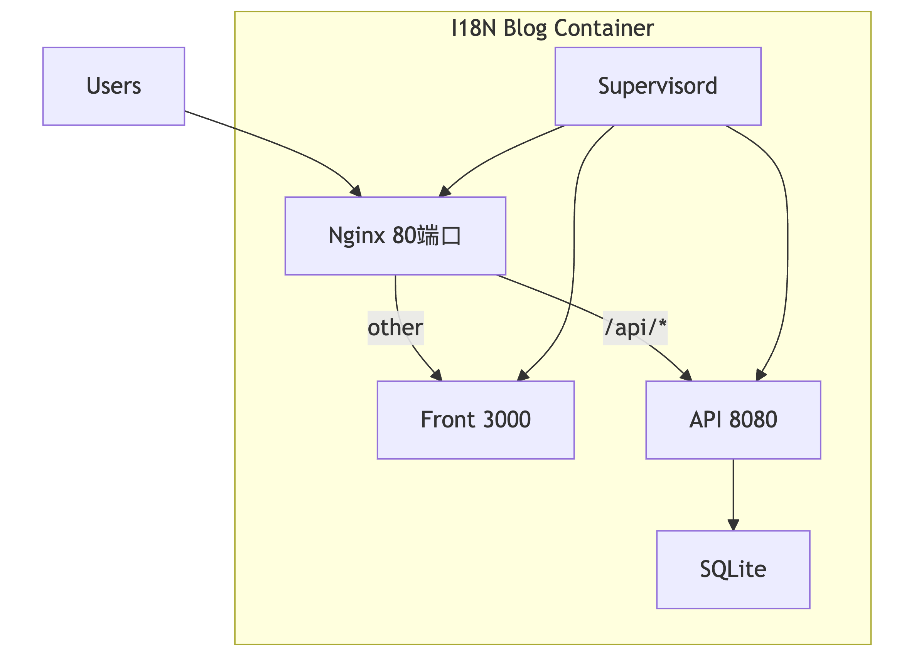

[中文](./README_CN.md) | English

# I18N Blog

A full-stack blog application with Go backend and Next.js frontend, containerized with Docker for easy deployment.

## Features

- 📝 **Blog Management**: Create, edit, and delete articles
- 🌍 **Multi-language Support**: 70+ languages interface
- 🏷️ **Category System**: Organize posts by categories  
- 🌙 **Dark Mode**: Toggle between light and dark themes
- 📱 **Responsive Design**: Mobile-first responsive layout
- ⚡ **Fast Performance**: Optimized with modern frameworks
- 🔒 **Admin Panel**: Complete content management system
- ⚙️ **Site Settings**: Customizable site title and subtitle
- 🖋️ **Markdown Editor**: Rich text editing with live preview
- 🐳 **Docker Ready**: One-click deployment with Docker

### 🌐 Supported Languages

The system supports interface switching for 70+ languages:

**Core Languages** (Required):
- 🇨🇳 中文 (Chinese)
- 🇬🇧 English

**Asian Languages**:
- 🇯🇵 日本語 (Japanese)
- 🇰🇷 한국어 (Korean)
- 🇹🇭 ไทย (Thai)
- 🇻🇳 Tiếng Việt (Vietnamese)
- 🇮🇩 Bahasa Indonesia
- 🇲🇾 Bahasa Melayu
- 🇵🇭 Filipino (Tagalog)
- 🇲🇲 မြန်မာ (Myanmar)
- 🇰🇭 ខ្មែរ (Khmer)
- 🇱🇦 ລາວ (Lao)

**European Languages**:
- 🇪🇸 Español (Spanish)
- 🇫🇷 Français (French)
- 🇩🇪 Deutsch (German)
- 🇷🇺 Русский (Russian)
- 🇵🇹 Português (Portuguese)
- 🇮🇹 Italiano (Italian)
- 🇳🇱 Nederlands (Dutch)
- 🇸🇪 Svenska (Swedish)
- 🇩🇰 Dansk (Danish)
- 🇳🇴 Norsk (Norwegian)
- 🇫🇮 Suomi (Finnish)
- 🇵🇱 Polski (Polish)
- 🇨🇿 Čeština (Czech)
- 🇸🇰 Slovenčina (Slovak)
- 🇭🇺 Magyar (Hungarian)
- 🇷🇴 Română (Romanian)
- 🇧🇬 Български (Bulgarian)
- 🇭🇷 Hrvatski (Croatian)
- 🇷🇸 Српски (Serbian)
- 🇸🇮 Slovenščina (Slovenian)
- 🇪🇪 Eesti (Estonian)
- 🇱🇻 Latviešu (Latvian)
- 🇱🇹 Lietuvių (Lithuanian)
- 🇺🇦 Українська (Ukrainian)
- 🇧🇾 Беларуская (Belarusian)
- 🇹🇷 Türkçe (Turkish)
- 🇬🇷 Ελληνικά (Greek)
- 🇦🇱 Shqip (Albanian)
- 🇦🇲 Հայերեն (Armenian)
- 🇦🇿 Azərbaycan (Azerbaijani)
- 🇬🇪 ქართული (Georgian)

**Middle Eastern & African Languages**:
- 🇸🇦 العربية (Arabic)
- 🇮🇱 עברית (Hebrew)
- 🇮🇷 فارسی (Persian)
- 🇵🇰 اردو (Urdu)
- 🇪🇹 አማርኛ (Amharic)
- 🇰🇪 Kiswahili (Swahili)
- 🇿🇦 isiZulu (Zulu)
- 🇿🇦 Afrikaans

**South Asian Languages**:
- 🇮🇳 हिन्दी (Hindi)
- 🇧🇩 বাংলা (Bengali)
- 🇮🇳 தமிழ் (Tamil)
- 🇮🇳 తెలుగు (Telugu)
- 🇮🇳 മലയാളം (Malayalam)
- 🇮🇳 ಕನ್ನಡ (Kannada)
- 🇮🇳 ગુજરાતી (Gujarati)
- 🇮🇳 ਪੰਜਾਬੀ (Punjabi)
- 🇮🇳 मराठी (Marathi)
- 🇳🇵 नेपाली (Nepali)
- 🇱🇰 සිංහල (Sinhala)

**Pacific Languages**:
- 🇳🇿 Te Reo Māori (Maori)
- 🇼🇸 Gagana Samoa (Samoan)
- 🇹🇴 Lea Fakatonga (Tongan)
- 🇫🇯 Na Vosa Vakaviti (Fijian)

**Other Regional Languages**:
- 🇮🇪 Gaeilge (Irish)
- 🇮🇸 Íslenska (Icelandic)
- 🇲🇹 Malti (Maltese)
- 🇪🇸 Euskera (Basque)
- 🇪🇸 Català (Catalan)

## Quick Start

### 🚀 One-Click Deployment (Recommended)

Create a dedicated directory and deploy:

```bash
# 1. Create dedicated directory (recommended: /opt)
sudo mkdir -p /opt/i18n_blog
cd /opt/i18n_blog

# 2. Download and execute deployment script
curl -sSL https://raw.githubusercontent.com/xuemian168/i18n_blog/main/deploy-from-hub.sh -o deploy.sh && chmod +x deploy.sh && ./deploy.sh
```

> **Important Notes**:
> - Do not use `curl | bash` as it will cause syntax errors
> - Deploy in `/opt/i18n_blog` to avoid cluttering the home directory

### Manual Deployment

```bash
# 1. Create dedicated directory
sudo mkdir -p /opt/i18n_blog
cd /opt/i18n_blog

# 2. Create data directory
mkdir -p ./blog-data

# 3. Run container
docker run -d \
  --name i18n_blog \
  --restart unless-stopped \
  -p 80:80 \
  -v /opt/i18n_blog/blog-data:/app/data \
  -e NEXT_PUBLIC_API_URL="http://localhost/api" \
  -e DB_PATH="/app/data/blog.db" \
  -e GIN_MODE="release" \
  -e NODE_ENV="production" \
  -e JWT_SECRET="your-secure-secret-key" \
  ictrun/i18n_blog:latest
```

**⚠️ Important Configuration**:
- `NEXT_PUBLIC_API_URL` - **MUST be modified according to your network environment**
  - Local access: `http://localhost/api` or `http://127.0.0.1/api`
  - LAN access: `http://192.168.1.100/api` (use your actual IP)
  - Public domain: `https://yourdomain.com/api`
  - Non-80 port: `http://localhost:8080/api`
- `JWT_SECRET` - **Strongly recommended for production**
  - Secret key for signing JWT tokens
  - If not set, a random key is auto-generated (changes on restart)
  - Use a complex string of at least 32 characters

**Directory Structure**:
- `/opt/i18n_blog/` - Application main directory
- `/opt/i18n_blog/blog-data/` - Data storage (database and uploads)
- `/opt/i18n_blog/deploy.sh` - Deployment script (one-click method)

### 🛠️ Development Setup

#### Prerequisites

- [Docker](https://docs.docker.com/get-docker/)
- [Docker Compose](https://docs.docker.com/compose/install/)

#### Local Development

1. **Clone the repository**:
   ```bash
   git clone <repository-url>
   cd blog
   ```

2. **Start the application**:
   ```bash
   ./start.sh
   ```

3. **Access the application**:
   - **Frontend**: http://localhost:3000
   - **API**: http://localhost:8080/api
   - **Admin Panel**: http://localhost:3000/admin

### 🐳 Docker Hub Deployment Options

#### Option 1: Using Docker Compose (Recommended)

```bash
# Download the compose file
curl -O https://raw.githubusercontent.com/xuemian168/i18n_blog/main/docker-compose.hub.yml

# Configure environment
cp .env.hub.example .env
# Edit .env with your settings

# Deploy
docker-compose -f docker-compose.hub.yml up -d
```

#### Option 2: Direct Docker Run

```bash
# Create dedicated directory
cd /opt/i18n_blog

# Run container with bind mount (modify NEXT_PUBLIC_API_URL!)
docker run -d \
  --name i18n_blog \
  --restart unless-stopped \
  -p 80:80 \
  -v /opt/i18n_blog/blog-data:/app/data \
  -e NEXT_PUBLIC_API_URL=https://your-api-domain.com/api \
  -e DB_PATH=/app/data/blog.db \
  ictrun/i18n_blog:latest
```

#### Available Tags

- `ictrun/i18n_blog:latest` - Latest stable release
- `ictrun/i18n_blog:v1.0.0` - Specific version
- `ictrun/i18n_blog:develop` - Development branch

### 🔧 Configuration

#### Environment Variables

| Variable | Default | Description |
|----------|---------|-------------|
| `NEXT_PUBLIC_API_URL` | `https://your-domain.com/api` | Your API endpoint URL |
| `DB_PATH` | `/app/data/blog.db` | SQLite database path |
| `GIN_MODE` | `release` | Go Gin mode (release/debug) |
| `NODE_ENV` | `production` | Node.js environment |
| `RECOVERY_MODE` | `false` | Password recovery mode |
| `JWT_SECRET` | *(auto-generated)* | JWT signing secret (recommended for production) |

#### First Time Setup

1. **Access the blog**: http://localhost (or your domain)
2. **Admin login**: http://localhost/admin
   - Username: `admin`
   - Password: `xuemian168`
3. **⚠️ Important**: Change the default password immediately!

### 📊 Management Commands

```bash
# Check status
docker ps | grep i18n_blog

# View logs
docker logs i18n_blog

# Backup data (from /opt/i18n_blog)
cd /opt/i18n_blog
sudo tar -czf blog-backup-$(date +%Y%m%d).tar.gz ./blog-data

# Stop and remove
docker stop i18n_blog
docker rm i18n_blog
```

## 🔄 Upgrade Instructions

### 🐳 For Docker Deployment (Single Container)

To upgrade your Docker deployment while preserving all data:

#### Step 1: Backup Your Data (Recommended)
```bash
# Create backup directory
mkdir -p ./backups/$(date +%Y%m%d_%H%M%S)

# Backup the data volume
docker run --rm -v blog-data:/data -v $(pwd)/backups/$(date +%Y%m%d_%H%M%S):/backup alpine sh -c "cd /data && tar czf /backup/blog-data-backup.tar.gz ."

# Or if using bind mount, simply copy the directory
cd /opt/i18n_blog
cp -r ./blog-data ./backups/$(date +%Y%m%d_%H%M%S)/
```

#### Step 2: Pull the Latest Image
```bash
docker pull ictrun/i18n_blog:latest
```

#### Step 3: Stop and Remove the Old Container
```bash
docker stop i18n_blog
docker rm i18n_blog
```

#### Step 4: Start the New Container
```bash
# If using named volume (recommended)
docker run -d \
  --name i18n_blog \
  --restart unless-stopped \
  -p 80:80 \
  -v blog-data:/app/data \
  -e NEXT_PUBLIC_API_URL=https://your-domain.com/api \
  -e DB_PATH=/app/data/blog.db \
  ictrun/i18n_blog:latest

# If using bind mount
cd /opt/i18n_blog
docker run -d \
  --name i18n_blog \
  --restart unless-stopped \
  -p 80:80 \
  -v /opt/i18n_blog/blog-data:/app/data \
  -e NEXT_PUBLIC_API_URL=https://your-domain.com/api \
  -e DB_PATH=/app/data/blog.db \
  ictrun/i18n_blog:latest
```

#### Step 5: Verify the Upgrade
```bash
# Check container status
docker ps | grep i18n_blog

# Check logs for any errors
docker logs i18n_blog

# Test the application
curl -f http://localhost/api/categories || echo "API check failed"
```

### 🐳 For Docker Compose Deployment

To upgrade your Docker Compose deployment while preserving all data:

#### Step 1: Backup Your Data (Recommended)
```bash
# Create backup directory
mkdir -p ./backups/$(date +%Y%m%d_%H%M%S)

# Stop services temporarily for consistent backup
docker-compose stop

# Backup the data volume
docker run --rm -v blog_blog_data:/data -v $(pwd)/backups/$(date +%Y%m%d_%H%M%S):/backup alpine sh -c "cd /data && tar czf /backup/blog-data-backup.tar.gz ."

# Or backup the entire compose environment
cp -r ./data ./backups/$(date +%Y%m%d_%H%M%S)/ 2>/dev/null || true
cp docker-compose.yml ./backups/$(date +%Y%m%d_%H%M%S)/ 2>/dev/null || true
cp .env ./backups/$(date +%Y%m%d_%H%M%S)/ 2>/dev/null || true

# Restart services
docker-compose start
```

#### Step 2: Pull the Latest Images
```bash
docker-compose pull
```

#### Step 3: Upgrade with Zero Downtime
```bash
# Method 1: Rolling update (recommended for production)
docker-compose up -d --force-recreate --remove-orphans

# Method 2: Complete restart (if you need to stop everything)
docker-compose down && docker-compose up -d
```

#### Step 4: Clean Up Old Images (Optional)
```bash
# Remove unused images to free up space
docker image prune -f

# Or remove specific old images
docker images | grep i18n_blog | grep -v latest | awk '{print $3}' | xargs docker rmi 2>/dev/null || true
```

#### Step 5: Verify the Upgrade
```bash
# Check all services status
docker-compose ps

# Check logs for any errors
docker-compose logs -f --tail=50

# Test the application
curl -f http://localhost:3000 || echo "Frontend check failed"
curl -f http://localhost:8080/api/categories || echo "API check failed"
```

### 🔄 Automated Upgrade Script

For convenience, you can create an automated upgrade script:

#### For Docker Deployment
```bash
#!/bin/bash
# save as upgrade-docker.sh

set -e

echo "🚀 Starting Docker deployment upgrade..."

# Configuration
CONTAINER_NAME="i18n_blog"
IMAGE_NAME="ictrun/i18n_blog:latest"
BACKUP_DIR="./backups/$(date +%Y%m%d_%H%M%S)"

# Create backup
echo "📦 Creating backup..."
mkdir -p "$BACKUP_DIR"
docker run --rm -v blog-data:/data -v "$BACKUP_DIR":/backup alpine sh -c "cd /data && tar czf /backup/blog-data-backup.tar.gz ."

# Pull latest image
echo "⬇️ Pulling latest image..."
docker pull "$IMAGE_NAME"

# Stop and remove old container
echo "🛑 Stopping old container..."
docker stop "$CONTAINER_NAME" 2>/dev/null || true
docker rm "$CONTAINER_NAME" 2>/dev/null || true

# Start new container
echo "🚀 Starting new container..."
docker run -d \
  --name "$CONTAINER_NAME" \
  --restart unless-stopped \
  -p 80:80 \
  -v blog-data:/app/data \
  -e NEXT_PUBLIC_API_URL="${NEXT_PUBLIC_API_URL:-http://localhost/api}" \
  -e DB_PATH=/app/data/blog.db \
  "$IMAGE_NAME"

# Verify
echo "✅ Verifying upgrade..."
sleep 10
if docker ps | grep -q "$CONTAINER_NAME"; then
  echo "✅ Upgrade completed successfully!"
  echo "📄 Backup saved to: $BACKUP_DIR"
else
  echo "❌ Upgrade failed! Check logs: docker logs $CONTAINER_NAME"
  exit 1
fi
```

#### For Docker Compose Deployment
```bash
#!/bin/bash
# save as upgrade-compose.sh

set -e

echo "🚀 Starting Docker Compose deployment upgrade..."

# Configuration
BACKUP_DIR="./backups/$(date +%Y%m%d_%H%M%S)"

# Create backup
echo "📦 Creating backup..."
mkdir -p "$BACKUP_DIR"
docker-compose stop
docker run --rm -v blog_blog_data:/data -v "$BACKUP_DIR":/backup alpine sh -c "cd /data && tar czf /backup/blog-data-backup.tar.gz ."
cp -r ./data "$BACKUP_DIR/" 2>/dev/null || true
cp docker-compose.yml "$BACKUP_DIR/" 2>/dev/null || true
cp .env "$BACKUP_DIR/" 2>/dev/null || true

# Pull and upgrade
echo "⬇️ Pulling latest images..."
docker-compose pull

echo "🔄 Upgrading services..."
docker-compose up -d --force-recreate --remove-orphans

# Clean up
echo "🧹 Cleaning up old images..."
docker image prune -f

# Verify
echo "✅ Verifying upgrade..."
sleep 15
if docker-compose ps | grep -q "Up"; then
  echo "✅ Upgrade completed successfully!"
  echo "📄 Backup saved to: $BACKUP_DIR"
else
  echo "❌ Upgrade failed! Check logs: docker-compose logs"
  exit 1
fi
```

### 🛠️ Rollback Instructions

If an upgrade fails, you can rollback to the previous version:

#### For Docker Deployment
```bash
# Stop the failed container
docker stop i18n_blog && docker rm i18n_blog

# Restore from backup (if needed)
docker run --rm -v blog-data:/data -v $(pwd)/backups/BACKUP_DATE:/backup alpine sh -c "cd /data && tar xzf /backup/blog-data-backup.tar.gz"

# Run the previous image version
docker run -d \
  --name i18n_blog \
  --restart unless-stopped \
  -p 80:80 \
  -v blog-data:/app/data \
  -e NEXT_PUBLIC_API_URL=https://your-domain.com/api \
  ictrun/i18n_blog:PREVIOUS_TAG
```

#### For Docker Compose Deployment
```bash
# Edit docker-compose.yml to use previous image tag
# Then restart
docker-compose down
docker-compose up -d

# Restore data if needed
docker-compose stop
docker run --rm -v blog_blog_data:/data -v $(pwd)/backups/BACKUP_DATE:/backup alpine sh -c "cd /data && tar xzf /backup/blog-data-backup.tar.gz"
docker-compose start
```

### 📋 Upgrade Checklist

- [ ] **Backup your data** before starting
- [ ] **Test the backup** by extracting it to a temporary location
- [ ] **Note your current version** for potential rollback
- [ ] **Check available disk space** for new images
- [ ] **Plan maintenance window** for production systems
- [ ] **Verify environment variables** are correctly set
- [ ] **Test the application** after upgrade
- [ ] **Monitor logs** for any issues
- [ ] **Update any external monitoring** or health checks
- [ ] **Document the upgrade** in your change log

### Manual Deployment

#### Development Mode
```bash
docker-compose up --build -d
```

#### Production Mode (with Nginx)
```bash
docker-compose -f docker-compose.prod.yml up --build -d
```

## Architecture

)

#### Important Configuration Notes

- **Runtime Configuration**: The API URL can be set dynamically at container startup via the `NEXT_PUBLIC_API_URL` environment variable.
- **No Rebuild Required**: Changes to the API URL only require restarting the container, not rebuilding the image.
- **Automatic Detection**: The system automatically detects and applies the API URL configuration during container startup.
- **Fallback Support**: If no environment variable is provided, defaults to `http://localhost:8080/api`.

#### Example Configurations

**Local Development:**
```bash
NEXT_PUBLIC_API_URL=http://localhost:8080/api
```

**Production:**
```bash
NEXT_PUBLIC_API_URL=https://yourdomain.com/api
```

The frontend will automatically use:
- API requests: `https://yourdomain.com/api/*`
- Base URL for SEO/metadata: `https://yourdomain.com`

### Docker Volumes

- `blog_data`: Persistent storage for SQLite database

## Management Commands

### Start Application
```bash
./start.sh
```

### Stop Application
```bash
./stop.sh
```

### View Logs
```bash
docker-compose logs -f
```

### Restart Services
```bash
docker-compose restart
```

### Clean Everything
```bash
docker-compose down -v
docker system prune -f
```

## Password Recovery

### When Admin Password is Forgotten

If you forget the admin password, follow these steps to reset it safely:

#### Step 1: Stop the Container
```bash
docker stop i18n_blog
```

#### Step 2: Enable Recovery Mode
Navigate to the application directory and run with recovery mode:
```bash
cd /opt/i18n_blog

docker run -d \
  --name i18n_blog_recovery \
  --restart unless-stopped \
  -p 80:80 \
  -v /opt/i18n_blog/blog-data:/app/data \
  -e NEXT_PUBLIC_API_URL="http://localhost/api" \
  -e DB_PATH="/app/data/blog.db" \
  -e RECOVERY_MODE="true" \
  ictrun/i18n_blog:latest
```

The system will:
- Reset the admin password to `xuemian168`
- Display the reset credentials in the logs
- **Refuse to start** for security reasons

#### Step 3: Check Reset Result
```bash
# View logs to confirm password reset
docker logs i18n_blog_recovery

# Remove recovery container
docker rm -f i18n_blog_recovery
```

#### Step 4: Start Blog Normally
```bash
# Run with normal mode
docker run -d \
  --name i18n_blog \
  --restart unless-stopped \
  -p 80:80 \
  -v /opt/i18n_blog/blog-data:/app/data \
  -e NEXT_PUBLIC_API_URL="http://localhost/api" \
  -e DB_PATH="/app/data/blog.db" \
  -e RECOVERY_MODE="false" \
  ictrun/i18n_blog:latest
```

#### Step 5: Login with New Password
- **Username**: `admin`
- **Password**: `xuemian168`

#### Step 6: Change Password Immediately
1. Login to the admin panel at `http://localhost/admin`
2. Go to **Settings** → **Security Settings**
3. Change your password to a secure one

### Security Notes

⚠️ **Important Security Considerations:**

- Recovery mode requires **physical access** to the server to modify environment variables
- The system **will not start** when recovery mode is active - this prevents unauthorized access
- Always **disable recovery mode** immediately after password reset
- **Change the default password** immediately after recovery
- Recovery mode is designed for emergency use only

### Troubleshooting Recovery Issues

**Problem**: System won't start after enabling recovery mode
**Solution**: This is intentional. Check the logs to confirm password was reset, then disable recovery mode.

**Problem**: Recovery mode doesn't reset password
**Solution**: Ensure the environment variable is set correctly (`RECOVERY_MODE=true`) and check Docker logs for error messages.

## Development

### Local Development (without Docker)

#### Backend
```bash
cd backend
go mod download
go run cmd/server/main.go
```

#### Frontend
```bash
cd frontend
npm install
npm run dev
```

### Building

#### Backend
```bash
cd backend
go build -o bin/server cmd/server/main.go
```

#### Frontend
```bash
cd frontend
npm run build
npm start
```

## Troubleshooting

### Common Issues

1. **Port conflicts**: Make sure ports 3000 and 8080 are available
2. **Docker permissions**: Run with `sudo` if needed on Linux
3. **Build failures**: Clear Docker cache with `docker system prune -f`
4. **Deployment script errors**: 
   - **Issue**: `curl | bash` fails with "syntax error near unexpected token 'fi'"
   - **Solution**: Download script first: `curl -sSL https://raw.githubusercontent.com/xuemian168/i18n_blog/main/deploy-from-hub.sh -o deploy.sh && chmod +x deploy.sh && ./deploy.sh`
   - **Reason**: Interactive scripts require local execution, not piped execution
5. **API URL issues**:
   - **Issue**: Frontend shows "Request URL: http://localhost:8080/api/..." even when `NEXT_PUBLIC_API_URL` is set
   - **Solution**: Restart the container to apply the new environment variable
   - **Verification**: Check container logs: `docker logs container-name` to see "Setting runtime API URL to: your-url"

### Health Checks

The application includes health checks for both services:
- Backend: `http://localhost:8080/api/categories`
- Frontend: `http://localhost:3000`

### Logs

View service logs:
```bash
# All services
docker-compose logs -f

# Specific service
docker-compose logs -f backend
docker-compose logs -f frontend
```

## Production Considerations

- Use `docker-compose.prod.yml` for production
- Configure proper SSL certificates in the `ssl` directory
- Update Nginx configuration for your domain
- Set up backup for the SQLite database
- Configure monitoring and logging

## License

MIT License