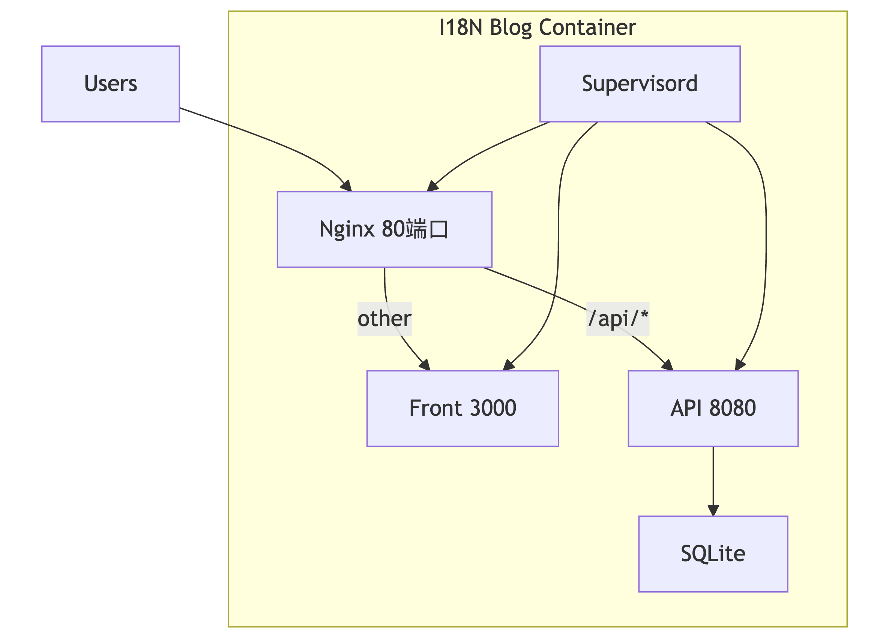

[中文](./README_CN.md) | English

# KUNO


**KUNO** /ˈkuːnoʊ/ — a lightweight, i18n-first CMS built with Go and Next.js. The name comes from "坤" (kūn, earth in the I Ching), meaning to carry and support all things.

A full-stack blog system containerized with Docker for easy deployment.

## Demo

[QUT.EDU.KG](https://qut.edu.kg/)

## Features

- Markdown editor with live preview and Mermaid diagram support
- 70+ language interface (i18n powered by next-intl)
- Dark / light theme toggle
- Responsive, mobile-first layout
- Category and tag management
- Admin panel for content management
- Customizable site title, subtitle, and branding
- SEO optimization with LLMs.txt support for AI search engines
- Usage analytics and performance monitoring
- Docker one-click deployment with blue-green strategy (< 2s downtime)
- Health checks and automatic rollback on failed deployments

### Supported Languages

| Region | Languages |
|--------|-----------|
| Core | Chinese, English |
| Asian | Japanese, Korean, Thai, Vietnamese, Indonesian, Malay, Filipino, Myanmar, Khmer, Lao |
| European | Spanish, French, German, Russian, Portuguese, Italian, Dutch, Swedish, Danish, Norwegian, Finnish, Polish, Czech, Slovak, Hungarian, Romanian, Bulgarian, Croatian, Serbian, Slovenian, Estonian, Latvian, Lithuanian, Ukrainian, Belarusian, Turkish, Greek, Albanian, Armenian, Azerbaijani, Georgian |
| Middle Eastern & African | Arabic, Hebrew, Persian, Urdu, Amharic, Swahili, Zulu, Afrikaans |
| South Asian | Hindi, Bengali, Tamil, Telugu, Malayalam, Kannada, Gujarati, Punjabi, Marathi, Nepali, Sinhala |
| Pacific & Others | Māori, Samoan, Tongan, Fijian, Irish, Icelandic, Maltese, Basque, Catalan |

## Quick Start

### One-Click Deployment (Recommended)

```bash
sudo mkdir -p /opt/kuno && cd /opt/kuno

curl -sSL "https://raw.githubusercontent.com/xuemian168/kuno/main/deploy-from-hub.sh?$(date +%s)" \
  -o deploy.sh && chmod +x deploy.sh && sudo ./deploy.sh
```

The script will ask you to:
1. Choose HTTP or HTTPS
2. Enter your domain (e.g. `qut.edu.kg`)
3. Pick standard or blue-green deployment
4. API URL is generated automatically

> **Note**: Don't pipe the script with `curl | bash` — download it first, then run. Deploy under `/opt/kuno` to keep things tidy.

### Quick Deploy (Existing Installations)

```bash
./quick-deploy.sh [image] [port] [container-name]

# Example:
./quick-deploy.sh ictrun/kuno:latest 80 kuno
```

Pulls the new image while the old container keeps serving, then swaps with < 2s downtime. Rolls back automatically if the new container fails health checks.

### Manual Deployment

```bash
sudo mkdir -p /opt/kuno && cd /opt/kuno
mkdir -p ./blog-data

docker run -d \
  --name kuno \
  --restart unless-stopped \
  -p 80:80 \
  -v /opt/kuno/blog-data:/app/data \
  -e NEXT_PUBLIC_API_URL="http://localhost/api" \
  -e DB_PATH="/app/data/blog.db" \
  -e GIN_MODE="release" \
  -e NODE_ENV="production" \
  -e JWT_SECRET="your-secure-secret-key" \
  ictrun/kuno:latest
```

⚠️ **You must set `NEXT_PUBLIC_API_URL` to match your actual environment**:
- Local: `http://localhost/api`
- LAN: `http://192.168.1.100/api`
- Public: `https://yourdomain.com/api`
- Non-80 port: `http://localhost:8080/api`

`JWT_SECRET` — set a 32+ character string for production. If omitted, a random key is generated (resets on restart).

### Docker Compose

```bash
curl -O https://raw.githubusercontent.com/xuemian168/kuno/main/docker-compose.hub.yml
cp .env.hub.example .env
# Edit .env with your settings
docker-compose -f docker-compose.hub.yml up -d
```

### Available Image Tags

- `ictrun/kuno:latest` — latest stable
- `ictrun/kuno:v1.0.0` — specific version
- `ictrun/kuno:develop` — development branch

## Configuration

### Environment Variables

| Variable | Default | Description |
|----------|---------|-------------|
| `NEXT_PUBLIC_API_URL` | `https://your-domain.com/api` | API endpoint URL |
| `DB_PATH` | `/app/data/blog.db` | SQLite database path |
| `UPLOAD_DIR` | `/app/data/uploads` | Upload directory |
| `GIN_MODE` | `release` | Gin mode (release/debug) |
| `NODE_ENV` | `production` | Node.js environment |
| `RECOVERY_MODE` | `false` | Password recovery mode |
| `JWT_SECRET` | *(auto-generated)* | JWT signing secret |

The API URL can be changed at runtime — just restart the container, no rebuild needed.

### First Login

- URL: `http://localhost/admin`
- Username: `admin`
- Password: `xuemian168`

⚠️ Change the default password immediately.

### Directory Structure

```
/opt/kuno/
├── blog-data/
│   ├── blog.db              # SQLite database
│   └── uploads/
│       ├── images/
│       ├── videos/
│       └── branding/
└── deploy.sh
```

## Architecture



## Upgrade

### Zero-Downtime (Recommended)

```bash
cd /opt/kuno
./deploy.sh                                    # choose blue-green
# or
./quick-deploy.sh ictrun/kuno:latest 80 kuno
```

### Traditional

```bash
docker stop kuno && docker rm kuno
docker pull ictrun/kuno:latest

cd /opt/kuno
docker run -d \
  --name kuno \
  --restart unless-stopped \
  -p 80:80 \
  -v /opt/kuno/blog-data:/app/data \
  -e NEXT_PUBLIC_API_URL=https://your-domain.com/api \
  -e DB_PATH=/app/data/blog.db \
  ictrun/kuno:latest
```

### Backup Before Upgrading

```bash
cd /opt/kuno
sudo tar -czf blog-backup-$(date +%Y%m%d).tar.gz ./blog-data
```

### Rollback

```bash
docker stop kuno && docker rm kuno

# Restore data if needed
sudo tar -xzf blog-backup-YYYYMMDD.tar.gz

# Run previous version
docker run -d --name kuno --restart unless-stopped \
  -p 80:80 -v /opt/kuno/blog-data:/app/data \
  -e NEXT_PUBLIC_API_URL=https://your-domain.com/api \
  ictrun/kuno:PREVIOUS_TAG
```

## Password Recovery

If you forget the admin password:

```bash
# 1. Stop the running container
docker stop kuno

# 2. Run a recovery container
docker run -d --name kuno_recovery \
  -p 80:80 \
  -v /opt/kuno/blog-data:/app/data \
  -e NEXT_PUBLIC_API_URL="http://localhost/api" \
  -e DB_PATH="/app/data/blog.db" \
  -e RECOVERY_MODE="true" \
  ictrun/kuno:latest

# 3. Check logs — password resets to xuemian168, then the container refuses to start (by design)
docker logs kuno_recovery
docker rm -f kuno_recovery

# 4. Start normally
docker run -d --name kuno --restart unless-stopped \
  -p 80:80 \
  -v /opt/kuno/blog-data:/app/data \
  -e NEXT_PUBLIC_API_URL="http://localhost/api" \
  -e DB_PATH="/app/data/blog.db" \
  -e RECOVERY_MODE="false" \
  ictrun/kuno:latest

# 5. Log in with admin / xuemian168 and change the password immediately
```

Recovery mode requires server access to set the env var, and the system won't serve traffic while it's active.

## Development

### Local (without Docker)

```bash
# Backend
cd backend
go mod download
go run cmd/server/main.go

# Frontend
cd frontend
npm install
npm run dev
```

Access at: frontend `http://localhost:3000`, API `http://localhost:8080/api`, admin `http://localhost:3000/admin`.

### With Docker

```bash
# Dev
docker-compose up --build -d

# Production (with Nginx)
docker-compose -f docker-compose.prod.yml up --build -d
```

## Common Commands

```bash
docker ps | grep kuno          # status
docker logs kuno               # logs
docker restart kuno            # restart
docker stop kuno               # stop
```

## Troubleshooting

- **Port conflict**: Change `-p 80:80` to `-p 8080:80`
- **API URL not taking effect**: Restart the container. Check logs for "Setting runtime API URL to: ..."
- **Deploy script syntax error**: Don't use `curl | bash`. Download first, then run.
- **Build failures**: `docker system prune -f` to clear cache

Health check endpoints: backend `http://localhost:8080/api/categories`, frontend `http://localhost:3000`.

## Sponsorship

This project is sponsored by [TIKHUB.IO](https://tikhub.io/)

> TikHub.io provides social media data APIs and tools for developers, creators, and businesses.


## License

[Apache License 2.0](./LICENSE)
